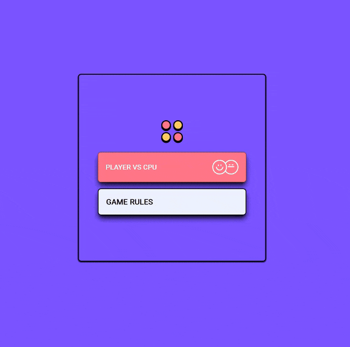

# Connect Four Game

The classic connect four game which features a difficulty system and timer mechanics to make the game challenging.

## 🔗 Links

- **Live Demo Link:** https://e3prime.github.io/connect_four

## 🔴 Connect Four Showcase

## 🧐 About The Project

This game project takes the traditional "Connect Four" that offers a casual or challenging experience based off the difficulty that has been chosen.
It also introduces a layer of tension via **Variable Time Constraints**. The player must not only outsmart the AI but also outrun the clock, with the allowed thinking time decreasing as the difficulty increases.

### Key Features

- **Adaptive AI Difficulty:**
  - **Easy:** The CPU plays randomly, allowing casual players to enjoy the game.
  - **Medium:** A hybrid model with a 50% chance to make a "Smart" move and a 50% chance to make a (random) move.
  - **Hard:** The CPU makes calculated moves.
- **Variable Timer Mechanic:**
  - **Easy:** 20 Seconds per turn.
  - **Medium:** 10 Seconds per turn.
  - **Hard:** 7 Seconds per turn.
  - **Penalty:** If the timer reaches zero, the player's turn is skipped, handing the advantage to the CPU.
- **Polished UX:**
  - **Animated Rules:** A dedicated "How to Play" section.
  - **Score Tracking:** Persistently tracks wins for both Player 1 and the CPU during the session.
